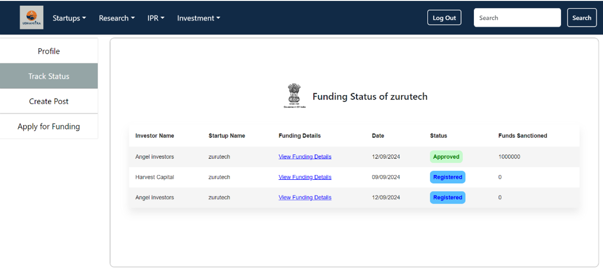
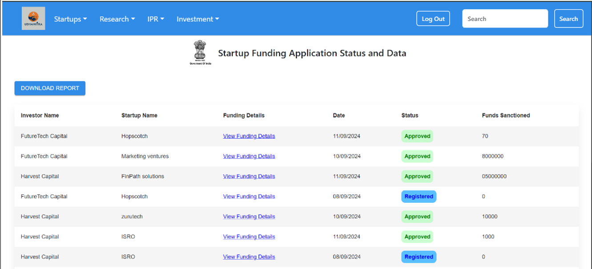
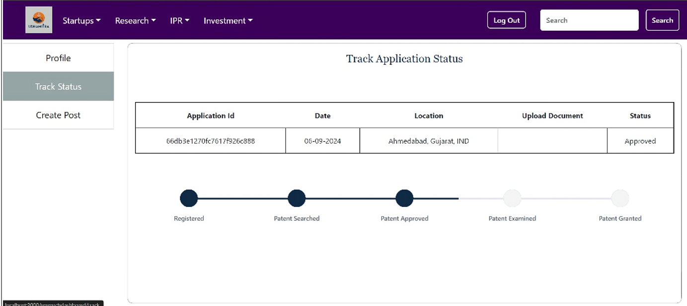
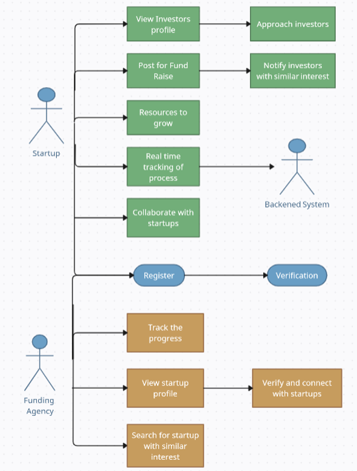
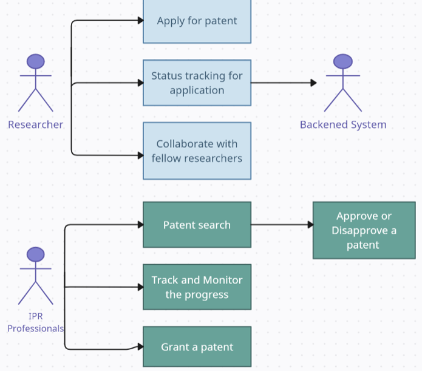

# Comprehensive Project Documentation

## Problem Statement:
Enhancing Monitoring and Management of Research, IPR, Innovation, and Start-ups in Gujarat State.

## Key Features:

### Authentication:
- Secure Signup and Login for all users.
- Role-based access ensures data privacy for each stakeholder.

### Startups:
- Post projects, raise funding, and connect with investors.
- Apply for funding and track the real-time status of applications.
## Startup Status Dashboard:

### Investors:
- Search for startups, review applications, and track investments.
- Post new funding opportunities.
## Investor Status Dashboard:

### Government:
- Access all platform data for monitoring and maintenance.
- View all investor and startup activities, including status tracking and unified data.
## Gov Status Dashboard:

### Researchers & IPR:
- File patents and track the status.
- The IPR team conducts reviews and updates the application status.
## Research Status Dashboard:

## Technologies Used:
- **Frontend:** React.js, HTML, CSS, JavaScript, Bootstrap, Tailwind CSS
- **Backend:** Node.js, Express, EJS, MongoDB

## Use Case Diagram:

## Analysis:
- **Analytics and Reporting Tools:** Provide data-driven insights for policymakers and funding agencies to make informed decisions.
- **Predictive Analytics:** Advanced analytics techniques such as predictive modeling can help identify potential trends and outcomes, enabling proactive decision-making.

## Conclusion:
This project enhances collaboration and transparency between startups, investors, researchers, and government bodies. It simplifies resource management, accelerates innovation, and ensures better monitoring.

## GitHub Link:
[SIH-2024](https://github.com/dhruvishah122/SIH-2024)

